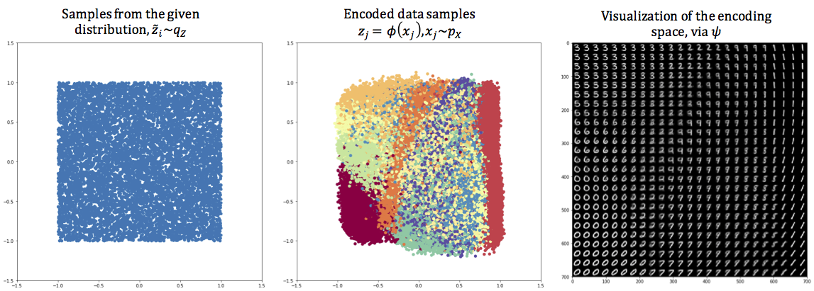
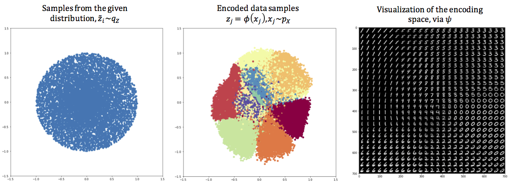

# SlicedWassersteinAE

This repository contains the implementation of our paper: "Sliced-Wasserstein Autoencoder: An Embarrassingly Simple Generative Model". The proposed method ameliorates the need for training adversarial networks in training generative models, and it provides a stable optimization while having a very simple implementation. 

### SWAE_MNIST_uniform.ipynb

This notebook trains the SWAE on the MNIST dataset with a uniform distribution in the embedding space. The figure below visualizes the embedded data and the embedding space for the MNIST dataset:

The trained autoencoder modules are also uploaded:

* MNIST_uniform_autoencoder.h5
* MNIST_uniform_encoder.h5
* MNIST_uniform_decoder.h5

### SWAE_MNIST_uniform.ipynb

Similarly, this notebook trains the SWAE on the MNIST dataset with a disk distribution in the embedding space. The figure below visualizes the embedded data and the embedding space for the MNIST dataset:

The trained autoencoder modules are also uploaded:

* MNIST_circle_autoencoder.h5
* MNIST_circle_encoder.h5
* MNIST_circle_decoder.h5

